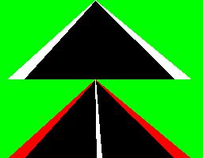

# Animation sur Hector en assembleur

Le modèle d'Hector étudié ici est le HR2+ ou HRX. Tout deux ont un processeur Z80 à 5 HMz et un affichage haute résolution de 14784 octets (231 lignes de 64 octets chacune)

Chaque octet sur l'écran contient l'information de 4 pixels (chaque pixel tenant sur 2 bits)

## Tester sur VB Hector

Les programmes sont conçus pour le modèle HR+. Les programmes en `.bin` sont utilisables directement sur VB Hector:

- Sélectionnez "HR Plus" en bas de la fenêtre et cliquez sur l'écran
- Sélectionnez le menu Mémoire / Chargement binaire
- Choisissez le `.bin` désiré
- Appuyez sur OK

La version `.K7` prend un peu plus de temps à charger, mais peut être convertie en `.wav` pour être ensuite enregistrée sur support physique:

- Sélectionnez "HR Plus" en bas de la fenêtre et cliquez sur l'écran
- Allez sur Ficher / Ouvrir fichier K7
- Choisissez le `.K7` désiré
- Appuyez sur 1 pour charger la K7

A noter que l'assemblable demande quelques différences entre ces deux formats:

- Les `.bin` démarrent par défaut à l'adresse `$4200` alors que les `.K7` démarrent à `$4C00` (d'où une directive `org` différente selon que le symbole `K7` est à 0 ou 1)
- Le code assembleur pour générer les `.bin` contient à la fois le code (addresse `$4200`) mais également les ressources graphiques chargées à l'adresse `$6000`. Pour les fichiers `K7` ce sont deux fichiers `.bin` distincts qui sont générés et fusionnés dans un fichier `.K7` (voir [create_K7.py](create_K7.py))
- "A fond! A fond! A fond!" prenant tant de mémoire, le bloc RAM à l'adresse `$6000-$C000` est quasiment rempli. Mais le bloc à l'adresse `$4000-$5FA0` étant lui aussi près d'être plein, le fichier K7 doit charger des ressources à l'adresse `$4100` (tout ce qui se trouve dans `afond_lower_ram.asm`) étant donné que le code commence à l'adresse `$4C00`.

## Scrolling de base

Le programme `olipix.bin` (code source: [olipix.asm](olipix.asm)) montre un exemple de scrolling le plus simple, utilisant l'instruction Z80 `ldir` qui effectue une copie mémoire. Cette instruction n'est pas la plus rapide mais est la plus simple. Elle consomme 22 cycle par octet copié.

Avec un Z80 à 5 HMz, pour un scrolling plein écran cela correspond à 5000000 / 14784 / 22 = 15 FPS (Frame per Second, ou image par seconde). Pas le scrolling le plus rapide du monde mais pas mal non plus pour du plein écran sur Hector.

Le programme Henon part 1 (`henon1.bin` ou `henon1.K7`) utilise cette technique, copiant en bas de l'écran une nouvelle ligne provenent de la prochaine tuile à afficher.

## Animation horizontale fluide de sprites

Henon part 1 et 2 ont tous deux un vaisseau dont l'animation horizontale est fluide. Or changer l'adresse d'affichage d'un octet déplacerait le vaisseau de quatre pixels vers la gauche ou la droite. L'animation fluide est effectuée grâce au script [convert_sprite.py](convert_sprite.py) qui lit l'image `sprite.png` et la converti au format Hector avec les ajouts suivants:

- Quatre versions sont générées. La version originale de `sprite.png`, et trois versions décalées de respectivement 1, 2 et 3 pixels vers la droite
- Le masque est automatiquement généré (couleur noire). Ici, tous les pixels qui ne font pas partie du masque sont colorés en blanc (couleur 3)

## Afficher un sprite en mode "cookie-cutter"

Lorsque l'on veut afficher un sprite en mode "cookie-cutter" (c'est-à-dire avec un masque) et/ou détecter les collisions avec le décor, on peut utiliser les opérations logiques `and` et `or`. Imaginons que `ix` pointe vers un octet du sprite à afficher, `ix+10` vers le masque associé et `iy` vers l'écran.

```
    ld a, (ix+10)       ; A = masque du sprite
    cpl                 ; On interverti le masque
    and (iy)            ; On compare avec l'octet de l'écran
    cp 0                ; Si les deux octets ont un bit en commun...
    jp nz, collision    ; ... on a une collision!

    ; Pas de collision, on peut afficher le sprite
    ld a, (ix+10)       ; A = masque du sprite
    and (iy)            ; On applique le masque à l'octet provenent de l'écran. Tous les pixels derrière le sprite sont effacés
    or (ix)             ; On applique l'octet du sprite
    ld (iy), a          ; On affiche le résultat à l'écran
```

Une autre technique est d'utiliser la pile pour copier des données. Les instructions `push` et `pop` sont en effet très rapides et copies 2 octets à la fois. En redéfinissant `sp` (stack pointer ou pointeur vers la pile), on peut copier des données de/vers une adresse désirée.

Considérons un exemple où `sprite` est l'adresse du sprite à afficher et `ix` pointe vers l'adresse de l'écran. Le sprite est encodé de telle sorte que chaque octet du sprite est précédé par l'octet du masque associé. Ainsi, chaque appel à `pop` va d'un coup charger un octet du sprite et son masque associé.

```
    di                  ; On désactive les interruptions
    ld sp, (sprite)     ; On change la pipe pour pointer vers
    ...
    pop bc              ; B = valeur du sprite, C = valeur du masque
                        ; Cette opération modifie sp, si bien que ce dernier pointe vers le prochain
    ld a, (ix)          ; A = valeur de l'écran
    and c               ; A = écran + masque
    or b                ; A = écran + masque + sprite
    ld (ix), a          ; On copie la valeur
    inc ix              ; On passe à l'octet suivant de l'écran
    ...
    ld sp, (...)        ; Soit on a sauvé la précédente valeur de sp, soit la valeur est toujours la même
    ei                  ; On réactive les interruptions
```

A noter que lorsque l'on modifie la pointers vers la pile (`sp`) il faut désactiver les interruptions. Sans ça, du code tiers pourrait modifier la pile, modifiant ainsi les ressources du sprite.

## Animer une piste de course

Pour le programme "A fond! A fond! A fond!", Python a été utilisé pour générer de nombreuses tables. Tout d'abord pour créer la piste (cela permet de changer des paramètres si besoin est). Deux images PNG sont générées, converties au format Hector et incorporées au programme:



Une piste est une combinaison de lignes de ces deux images. Le script [afond_create_track_ptr.py](afond_create_track_ptr.py) génère 24 tables (une pour chaque image de l'animation). Chaque table indique pour chaque ligne de la piste (100 lignes) l'adresse mémoire de la ligne a afficher. Cela prend 4800 octets mais permet de minimiser les calculs à effectuer.

Chaque ligne est copiée à l'écran en utilisant 64 instructions `ldi` consécutives. L'avantage de cette instruction est qu'elle est plus rapide que `ldir` avec 16 cycles par octet copié au lieu de 22 (forcément, on ne décrémente pas le compteur à chaque octet). Etant donné que le gros de l'animation est sur 130 lignes (30 lignes pour les montagnes et 100 lignes pour la piste), le maximum théorique est de 5000000 / 64 / 130 / 16 = 37 FPS. Le jeu a une vitesse effective de 30 FPS du fait de nombreux autres calculs (voiture à dessiner en mode "cookie cutter", calculer l'évolution de la vitesse du véhicule, sa position sur le circuit, etc.)

Pour les virages, une autre table (`turn_shift`) contient pour chaque degré de virage le nombre d'octets de décalage à effectuer lors de la copie de ligne. Un décalage en octets implique un décalage par bloc de 4 pixels. Cela implique également qu'une ligne peut déborder sur la ligne précédente/suivante, mais ce n'est visible que sur la ligne juste avant et juste après la piste.
